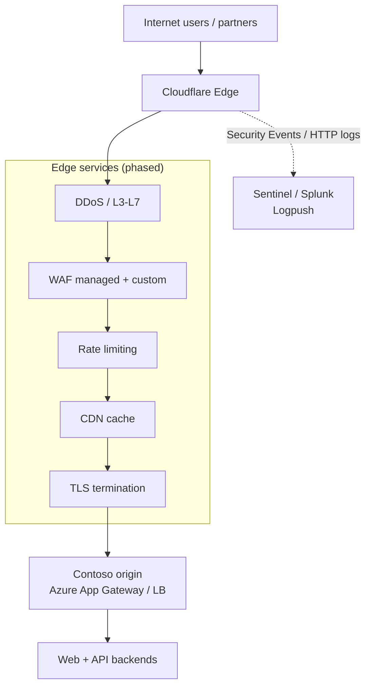

# Architecture & Design — Secure by Design

## Target reference architecture



## Onboarding model options

| Model | When to use | Disruption profile |
|-------|-------------|-------------------|
| **Full setup (NS delegation)** | Enterprise default; full DNS + proxy control | NS change at registrar; 24–48h TTL propagation |
| **Partial CNAME setup** | Apex cannot change NS quickly; phased app onboarding | Per-hostname CNAME; apex may need redirect partner |
| **Reverse proxy (orange cloud only)** | SaaS or immovable DNS | CNAME to `*.cdn.cloudflare.net` equivalent |

**Contoso recommendation:** Full setup for `contoso.com` zone after pilot on `pilot.contoso.com` or `www`-only CNAME pilot.

## Traffic flow (post cutover)

1. Client resolves `www.contoso.com` → Cloudflare anycast IP (proxied record)
2. TLS handshake at edge (Universal SSL or Advanced Certificate Manager)
3. WAF evaluates request (phase 4: log; phase 6: block)
4. Cache HIT or forward to origin over **Full (strict)**
5. Origin sees connection from Cloudflare IP; uses `CF-Connecting-IP` for client IP

## Secure-by-design principles

### 1. Defense in depth (layers)

| Layer | Control | Phase |
|-------|---------|-------|
| Edge | DDoS (automatic) | Cutover day |
| Edge | Managed WAF | Log → simulate → block |
| Edge | Custom WAF rules | After observation |
| Edge | Rate limits | Auth/API paths |
| Origin | NSG allow Cloudflare only | Pre-cutover |
| App | AuthZ, input validation | Unchanged |
| Identity | Zero Trust (optional later) | Separate project |

### 2. Least privilege (Cloudflare account)

| Role | Dashboard access | API token |
|------|------------------|-----------|
| Super Admin | 2–3 people | Break-glass only |
| Security Admin | WAF, firewall, SSL | Terraform CI (zone-scoped) |
| DNS Admin | DNS records | Automation for DNS only |
| Read-only SOC | Analytics, Security Events | Logpull read |
| Developer | Cache purge (scoped) | No WAF edit |

Use **Account Custom Roles** (Enterprise) where possible.

### 3. Separation of duties

- DNS cutover approver ≠ WAF rule deployer
- Terraform apply requires PR + second reviewer
- Emergency block rule: pre-approved runbook + post-incident review

### 4. Fail-safe defaults at cutover

| Setting | Cutover value | Later value |
|---------|---------------|-------------|
| SSL mode | Full (strict) if origin ready; else Full temporarily | Full (strict) |
| Always Use HTTPS | On | On |
| Minimum TLS | 1.2 | 1.2 → 1.3 only after QA |
| WAF managed rules | Off or Log | Block (phased) |
| HSTS | **Off** | On after 30 days stable |
| HTTP/3 | Off | On after performance baseline |
| Browser Integrity Check | Off initially | On if low FP rate |
| Bot Fight Mode | Off on API | Super Bot Fight / BM Enterprise later |

### 5. Observability by design

- Enable **Security Events** from day 1 post-cutover
- **Logpush** to SIEM within 2 weeks (HTTP + firewall events)
- Baseline metrics: origin 5xx, TTFB, WAF action counts, cache ratio

## DNS design (Contoso zone)

```
contoso.com          A/AAAA     proxied → App Gateway (or CNAME to www)
www.contoso.com      CNAME      proxied → contoso.com or direct origin
api.contoso.com      CNAME      proxied → api-origin.contoso.com
_acme-challenge.*    TXT        DNS-01 if needed
@                    MX         NOT proxied — mail provider
@                    TXT        SPF, DKIM, domain verify
```

**Proxy status:** Orange cloud (proxied) for HTTP services; grey cloud for mail-only and non-HTTP records.

## SSL/TLS design

| Component | Choice | Rationale |
|-----------|--------|-----------|
| Edge cert | Universal SSL or ACM wildcard | Fast issuance |
| Origin cert | Valid public cert or Cloudflare Origin CA | Required for Full (strict) |
| Mode | Full (strict) | Prevents origin bypass and SSL stripping |
| Authenticated Origin Pulls | Phase 7 optional | mTLS edge→origin |

## WAF design (high level)

**Phase 4 — Baseline (cutover + week 1)**

- OWASP Core Ruleset: **Log** or **Simulate** (Enterprise)
- Cloudflare Managed Ruleset: **Log**
- No custom block rules except documented emergency allow for monitoring IPs

**Phase 6 — Enforce**

- Managed rules: **Block** with tuned exceptions
- Custom rules from threat model (path traversal, auth abuse) — see [05-waf-security-phasing.md](05-waf-security-phasing.md)
- Reference lab expressions in [ADVANCED-WAF-RULES.md](../ADVANCED-WAF-RULES.md) — deploy incrementally

## Non-functional requirements

| NFR | Target |
|-----|--------|
| Availability | 99.9% edge (Enterprise SLA) |
| RTO (rollback NS) | < 4 hours |
| RPO (DNS) | Last exported zone file |
| Latency | ≤ +20 ms p95 vs direct origin (acceptable for security trade) |
| Compliance | Log retention 90 days in SIEM |

## Design sign-off artifacts

- Architecture diagram (this doc + customer-specific IPs)
- Data flow for PII (if forms on www)
- Decision log: SSL mode, caching policy, WAF phases
- Signed acceptance from App Owner + Security + DNS

---

Next: [03 — Project plan & milestones](03-project-plan-milestones.md)
