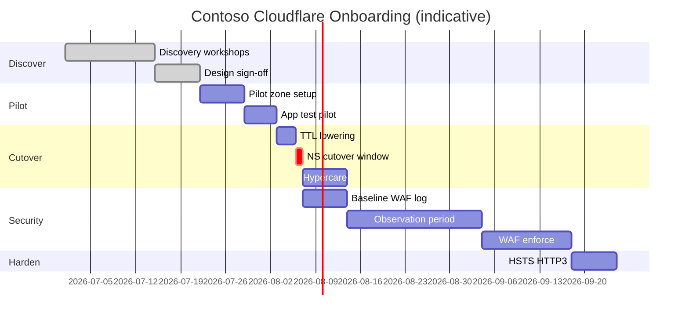

# Project Plan & Milestones

## Workstreams

| ID | Workstream | Owner (Contoso) | Owner (Consultant) |
|----|------------|-----------------|---------------------|
| WS1 | Program management | IT PM | Engagement lead |
| WS2 | DNS & cutover | DNS admin | Cloudflare SA |
| WS3 | Application validation | App owner | QA lead |
| WS4 | Security / WAF | Security architect | Security consultant |
| WS5 | Observability | SOC | SA |
| WS6 | IaC & automation | Platform engineer | Consultant |

See [RACI matrix](appendices/raci.md).

---

## Milestone overview



---

## Phase detail

### Phase 0 — Discover (Weeks 1–2)

**Deliverables**

- Completed [discovery checklist](checklists/discovery-checklist.md)
- Risk register
- DNS export (BIND)

**Exit criteria:** Steering committee approves Phase 1 budget and window.

---

### Phase 1 — Design (Week 3)

**Deliverables**

- Signed architecture ([02-architecture-design.md](02-architecture-design.md))
- Communication plan (internal + status page)
- Runbook drafts: cutover, rollback, hypercare

**Exit criteria:** App owner + Security + DNS sign design.

---

### Phase 2 — Pilot (Week 4)

**Objective:** Prove SSL mode, origin connectivity, and app behavior **before** production NS change.

**Steps**

1. Create zone `contoso.com` in Cloudflare (or use subdomain `pilot.contoso.com` in existing test zone)
2. Import DNS records — **do not change production NS yet**
3. Use **CNAME setup** or hosts file / `curl --resolve` testing:
   ```bash
   curl -I --resolve www.contoso.com:443:104.x.x.x https://www.contoso.com/
   ```
   (Replace with Cloudflare proxy IP from dashboard)
4. Validate: login flows, API POST, file upload, WebSockets
5. Run `zone_security_audit.py` against pilot zone name in `.env`

**Exit criteria:** QA sign-off on pilot test cases; zero P1 defects open.

---

### Phase 3 — Cutover (Week 5)

**Objective:** Move production DNS to Cloudflare with controlled propagation.

See [04-migration-cutover.md](04-migration-cutover.md).

**Deliverables**

- [Pre-cutover checklist](checklists/pre-cutover-checklist.md) signed
- Change ticket (CAB approved)
- [Post-cutover checklist](checklists/post-cutover-checklist.md) completed

**Exit criteria:** External monitoring green 24h; email flow verified.

---

### Phase 4 — Baseline security (Week 5–6)

**Objective:** Enable visibility without blocking legitimate traffic.

| Control | Action |
|---------|--------|
| Managed WAF | **Log** (Enterprise) or Simulate |
| SSL | Full (strict), Always HTTPS, TLS 1.2 minimum |
| Security Events | Dashboard access for SOC |
| Custom rules | **None blocking** — optional allow/skip for known scanners |

**Exit criteria:** Logpush job created (can be empty sink initially); Security Events flowing.

---

### Phase 5 — Observation (Weeks 6–9, minimum 14 days)

**Objective:** Baseline normal traffic before enforcement.

**Activities**

- Weekly WAF review meetings
- Tag false positives by URI, User-Agent, country, ASN
- Build exception list (narrow `skip` rules, not broad disables)
- Document top 10 requested paths and error rates

See [06-traffic-monitoring-tuning.md](06-traffic-monitoring-tuning.md).

**Exit criteria:** Signed "ready for enforce" memo from Security + App owner.

---

### Phase 6 — WAF enforce & custom rules (Weeks 9–11)

**Objective:** Move managed rules to block; add custom rules incrementally.

**Rule rollout order (one change per CAB window)**

1. Managed ruleset → Block (with agreed exceptions)
2. Custom: path traversal / dot-dot on `/api/*`
3. Custom: method override / header spoof probes
4. Custom: rate limit on `/api/v1/auth/*`
5. Advanced: host header / base64 decode rules (from lab patterns) — **only if app uses those patterns**

Use [WAF go-live checklist](checklists/waf-go-live-checklist.md).

**Exit criteria:** Block rules live; false positive rate within target; SIEM alerts configured.

---

### Phase 7 — Advanced TLS & performance (Week 12+)

**Objective:** HSTS, HTTP/3, optional mTLS — only after stability proven.

See [07-ssl-tls-advanced.md](07-ssl-tls-advanced.md).

**Exit criteria:** SSL Labs A+; HSTS max-age staged; HTTP/3 enabled with rollback documented.

---

## Project folder structure (Contoso repo mirror)

Recommended customer Git layout (can live beside this lab repo):

```
contoso-cloudflare/
├── README.md
├── docs/
│   ├── architecture/
│   ├── runbooks/
│   └── decision-log/
├── terraform/
│   ├── modules/waf-ruleset/
│   ├── environments/prod/
│   └── environments/staging/
├── scripts/
│   ├── audit/
│   └── validation/
└── .github/workflows/
    └── terraform-plan.yml
```

This lab repo’s `docs/enterprise-onboarding-contoso/` is the **consultant playbook**; Contoso clones the structure above for production IaC.

---

## Steering cadence

| Meeting | Frequency | Audience |
|---------|-----------|----------|
| Stand-up | Daily during cutover week | WS leads |
| WAF tuning | Weekly in observation | Security + App |
| SteerCo | Bi-weekly | IT leadership |
| Hypercare review | Daily × 5 days post-cutover | All WS |

---

## KPI dashboard

| KPI | Source | Review |
|-----|--------|--------|
| Origin 5xx rate | Azure Monitor / CF Analytics | Daily post-cutover |
| WAF actions (log/block) | Security Events | Weekly |
| Cache hit ratio | CF Analytics | Weekly |
| p95 TTFB | CF / synthetic | Weekly |
| Open false positives | Tuning tracker | Weekly |

---

Next: [04 — Migration & cutover](04-migration-cutover.md)
