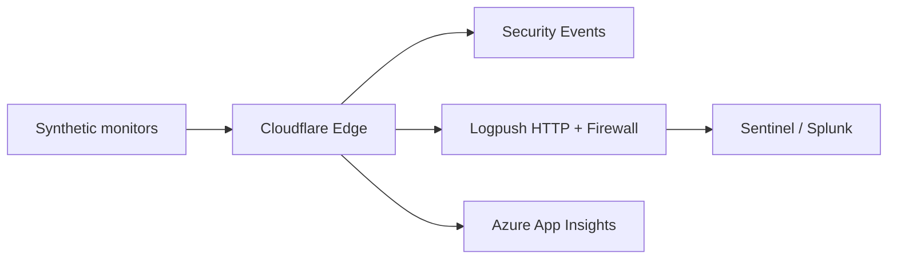

# Traffic Monitoring & Tuning

## Objectives

- Establish **normal** traffic baseline before WAF enforcement
- Detect false positives with evidence (Security Events, logs)
- Feed tuning decisions into CAB-approved rule changes

## Monitoring stack

## Day-1 dashboards (minimum)

| Dashboard | Metrics |
|-----------|---------|
| Edge health | Requests, 4xx/5xx, cache hit %, bandwidth |
| WAF (log phase) | Triggered rules, top paths, top IPs |
| Origin | 5xx, latency p95, connection count from CF IPs |
| Business | Login success, checkout completion (app-level) |

## Security Events workflow

1. **Filter:** `action eq log` (observation) then `action eq block` (enforce)
2. **Group by:** Rule ID, URI path, ASN, country
3. **Sample:** Export 20 events per rule for app owner review
4. **Decision:** Block confirmed / Skip exception / App fix required

### Useful filters

| Scenario | Filter idea |
|----------|-------------|
| API false positives | `http.request.uri.path contains "/api/"` |
| Single partner ASN | `ip.src.asnum eq 12345` |
| New rule validation | `ruleId eq "<uuid>"` |

## Logpush (Enterprise — within 2 weeks of cutover)

| Dataset | Destination | Retention |
|---------|-------------|-----------|
| HTTP requests | Sentinel / S3 | 90 days |
| Firewall events | Sentinel | 90 days |
| DNS logs | Optional | 30 days |

**Secure by design:** Logpush bucket with encryption, no public ACL, least-privilege write token.

## Synthetic checks (every 1–5 min)

| Check | URL | Expected |
|-------|-----|----------|
| Homepage | `https://www.contoso.com/` | 200, keyword "Contoso" |
| API health | `https://api.contoso.com/health` | 200 JSON |
| Redirect | `http://www.contoso.com/` | 301 → HTTPS |
| SSL | TLS 1.2+ | Valid cert |

Run from **outside** Cloudflare (Catchpoint, Azure Monitor) and **through** Cloudflare.

## False positive playbook

| Step | Action |
|------|--------|
| 1 | User report or alert |
| 2 | Find event in Security Events (Ray ID) |
| 3 | Reproduce with `curl` + Ray ID header |
| 4 | If FP: narrow skip rule or managed rule exception |
| 5 | If true attack: keep block; add SIEM alert |
| 6 | Document in tuning log |

## Tuning log template

| Date | Rule ID | FP/TP | URI pattern | Action taken | Approver |
|------|---------|-------|-------------|--------------|----------|
| 2026-08-01 | abc123 | FP | `/api/v1/search?q=...` | Skip URL decode on search | Security |

## Observation phase exit criteria

Sign when **all** true:

- [ ] ≥ 14 days of log-mode managed rules
- [ ] Weekly tuning meetings completed (minutes archived)
- [ ] Top 5 triggered rules reviewed and dispositioned
- [ ] No unresolved P2+ false positive tickets
- [ ] App owner written approval for block mode
- [ ] Rollback tested on staging / rule disable verified

## Performance regression check

Compare pre vs post cutover (same time-of-day, weekday):

| Metric | Acceptable delta |
|--------|------------------|
| p95 TTFB | +20 ms |
| Origin CPU | +10% (CF offload should help static) |
| Error rate | No increase |

If regression: review cache rules, HTTP/2, Argo (Enterprise) — **before** blaming WAF.

---

Next: [07 — SSL/TLS & advanced edge](07-ssl-tls-advanced.md)
