# Enterprise Cloudflare Onboarding — Contoso

Solution design and implementation guide for onboarding **Contoso** production web properties to Cloudflare **without service disruption**, with **phased security controls** and **secure-by-design** governance.

This playbook mirrors patterns validated on the lab domain `mslearn.site` (personal/test) and scales them to an enterprise engagement: discovery → design → pilot → cutover → baseline security → observation → hardening → advanced TLS/performance.

---

## Who this is for

| Role | Primary documents |
|------|-------------------|
| **Engagement lead / SA** | [Executive summary](00-executive-summary.md), [Project plan](03-project-plan-milestones.md) |
| **Security architect** | [Architecture](02-architecture-design.md), [WAF phasing](05-waf-security-phasing.md), [Governance](08-governance-operations.md) |
| **DNS / platform engineer** | [Migration & cutover](04-migration-cutover.md), [Checklists](checklists/) |
| **App owner / QA** | [Traffic monitoring](06-traffic-monitoring-tuning.md), [SSL/TLS advanced](07-ssl-tls-advanced.md) |

---

## Document map

| # | Document | Purpose |
|---|----------|---------|
| 00 | [Executive summary](00-executive-summary.md) | Business case, scope, success criteria |
| 01 | [Discovery & readiness](01-discovery-readiness.md) | Inventory, dependencies, risk register |
| 02 | [Architecture & design](02-architecture-design.md) | Target state, traffic flow, secure-by-design |
| 03 | [Project plan & milestones](03-project-plan-milestones.md) | Phases, timeline, RACI, deliverables |
| 04 | [Migration & cutover](04-migration-cutover.md) | NS/CNAME strategies, zero-downtime steps |
| 05 | [WAF security phasing](05-waf-security-phasing.md) | Baseline → observe → enforce → advanced |
| 06 | [Traffic monitoring & tuning](06-traffic-monitoring-tuning.md) | Security Events, false positives, tuning |
| 07 | [SSL/TLS & advanced edge](07-ssl-tls-advanced.md) | HSTS, HTTP/3, mTLS — when and how |
| 08 | [Governance & operations](08-governance-operations.md) | RBAC, IaC, Logpush, change control |
| 09 | [Rollback & contingency](09-rollback-contingency.md) | Revert paths, war room, comms |

### Checklists

- [Discovery checklist](checklists/discovery-checklist.md)
- [Pre-cutover checklist](checklists/pre-cutover-checklist.md)
- [Post-cutover checklist](checklists/post-cutover-checklist.md)
- [WAF go-live checklist](checklists/waf-go-live-checklist.md)

### Appendices

- [RACI matrix](appendices/raci.md)
- [Lab-to-enterprise mapping](appendices/lab-to-enterprise-mapping.md) — what `mslearn.site` proved vs what Contoso adds
- [Stakeholder walkthrough (45 min)](appendices/stakeholder-walkthrough.md) — narrative for leading the engagement

---

## Engagement at a glance

```mermaid
flowchart LR
  subgraph P0["Phase 0 — Discover"]
    D[Inventory & risks]
  end
  subgraph P1["Phase 1 — Design"]
    A[Architecture sign-off]
  end
  subgraph P2["Phase 2 — Pilot"]
    P[Pilot zone / subdomain]
  end
  subgraph P3["Phase 3 — Cutover"]
    C[DNS / NS migration]
  end
  subgraph P4["Phase 4 — Baseline"]
    B[SSL + managed WAF log]
  end
  subgraph P5["Phase 5 — Observe"]
    O[2–4 weeks traffic study]
  end
  subgraph P6["Phase 6 — Enforce"]
    E[Block + custom rules]
  end
  subgraph P7["Phase 7 — Harden"]
    H[HSTS HTTP/3 mTLS]
  end
  P0 --> P1 --> P2 --> P3 --> P4 --> P5 --> P6 --> P7
```

**Golden rule:** Never flip nameservers and enable aggressive WAF block rules in the same change window.

---

## Related repo assets

| Asset | Use in Contoso engagement |
|-------|---------------------------|
| [ADVANCED-WAF-RULES.md](../ADVANCED-WAF-RULES.md) | Custom rule patterns (deploy after observation phase) |
| `scripts/zone_security_audit.py` | Pre/post cutover baseline audit |
| `terraform/main.tf` | WAF-as-code template for Enterprise change control |
| `mslearn.site` lab | Reference for expression syntax and curl validation |

---

*Contoso is a fictional enterprise used for solution design examples. Replace domains, contacts, and IDs with customer values.*
