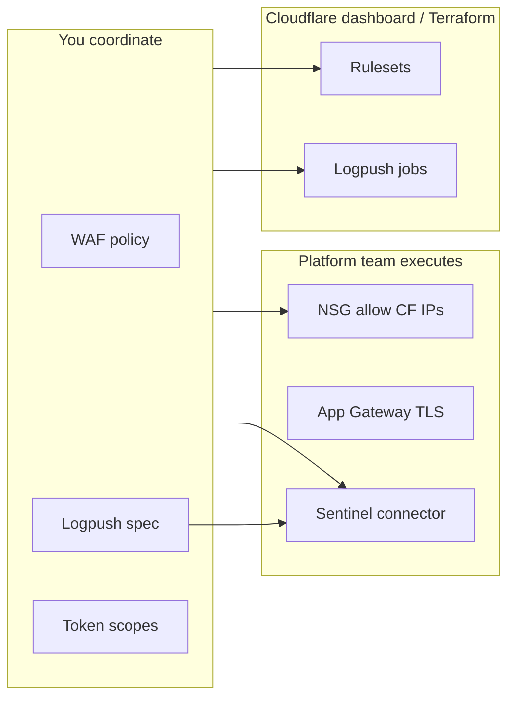

# Role Scope & RACI — Senior Security Engineer

## Your title in the room

**Senior Cloud Security Engineer** (Azure + Cloudflare edge) — security workstream lead for the onboarding program.

## What you own (Accountable / Responsible)

| Deliverable | A/R |
|-------------|-----|
| WAF phasing plan (log → observe → block) | **A** |
| Managed + custom WAF rule content | **R/A** |
| False positive triage and tuning log | **R/A** |
| “Ready to enforce” sign-off | **A** |
| Security Events / Logpush requirements for SOC | **R** (SOC **A** for SIEM ops) |
| API token scope design for Terraform | **R/A** |
| WAF rollback during incidents | **R/A** |
| HSTS / HTTP/3 **security policy** (timing, max-age stages) | **R** (Platform **A** for toggle) |
| Cutover security checklist (WAF off block, HSTS off) | **R/A** |

## What you do **not** own

| Task | Who owns | Your involvement |
|------|----------|------------------|
| Change NS at registrar | DNS admin | **Consulted** — review checklist |
| Import BIND / create A records | DNS / Platform | **Informed** — verify proxy status on web records |
| Fix origin app bugs | App owner | **Consulted** when WAF triggers on bad input |
| App Gateway NSG rules (allow CF IPs) | Azure platform | **Responsible to require** — you verify, they implement |
| Functional QA test cases | App / QA | **Consulted** on security test URLs |
| Terraform pipeline plumbing | Platform | **Author** WAF modules; they run `apply` |

## Azure + Cloudflare — your bridge responsibilities



**Real example — NSG ticket you file (you don’t click Azure):**

```
Title: Allow Cloudflare egress to App Gateway (Contoso cutover)
Description: Inbound 443 from Cloudflare IP ranges to AGW frontend.
             Ref: https://www.cloudflare.com/ips/ (IPv4 + IPv6)
             Required before NS cutover T-24h.
Assignee: Azure Platform team
Your role: Verify with curl 521/522 vs 526 after they apply
```

## Decision rights

| Decision | You alone? | Needs |
|----------|------------|-------|
| Enable WAF block on production | No | App owner + CAB |
| Emergency disable WAF rule | Yes (then retro within 24h) | Incident commander informed |
| Roll back nameservers | No | DNS admin **A** |
| Set SSL to Flexible | **Never recommend** | N/A |
| HSTS max-age 1 year | No | CISO delegate + Platform |

## Tools you actually use day to day

| Tool | Example use |
|------|-------------|
| Cloudflare dashboard | Security Events, WAF rulesets |
| `curl` + Ray ID | Reproduce FP or confirm block |
| `scripts/zone_security_audit.py` | Baseline before/after cutover |
| Terraform (WAF module) | PR for rule changes |
| Sentinel / KQL | Correlate firewall logs with app errors |
| ITSM (ServiceNow/Jira) | CAB tickets CHG00xxxx |

## Anti-patterns (don’t get caught doing this)

1. **Changing DNS** when your role is security — know *who* does it, show *checklist* instead.
2. **Block mode on cutover night** — instant credibility loss.
3. **Broad skip rule** (`skip all /api/*`) — show narrow exception with path + method.
4. **Claiming you “implemented HSTS day one”** — senior engineers stage it.

---

Next: [Phase 0 — Discovery](phases/phase-0-discovery.md)
